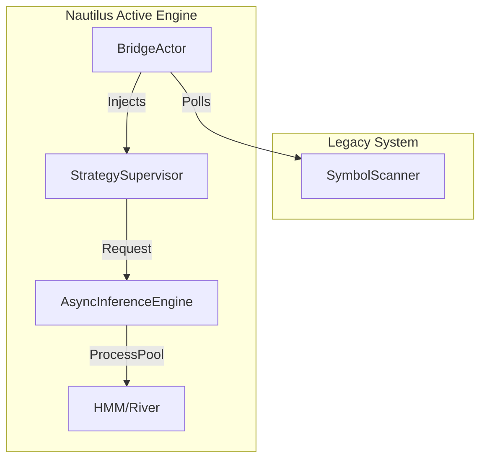

# Nautilus HMM Starter Pack (Neuro-Symbolic Edition)

> [!IMPORTANT]
> **Production Status**: Phase 7 Completed (Neuro-Symbolic Verified).
> **Entry Point**: `python3 neuro_symbolic_main.py`
> **Topology**: Integrated Bridge Actor + Async Inference Engine + Strategy Supervisor.

## Quickstart

| Step | Command | Purpose |
|------|---------|---------|
| 0 | `cp env.example .env` | Populate credentials (especially `BINANCE_API_KEY`). **Mandatory**. |
| 1 | `make bootstrap` | Sync pinned Python/Node dependencies. |
| 2 | `python3 neuro_symbolic_main.py` | **Launch the Neuro-Symbolic Trading Node**. |

## Architecture: The Neuro-Symbolic Loop

The system operates on an advanced **Neuro-Symbolic** architecture (Phase 7), unifying deep learning with deterministic execution.

### Key Components

1.  **Bridge Actor**: Safe gateway that funnels external signals (Scanner, DeepSeek) into the high-frequency event loop using `call_soon_threadsafe`.
2.  **Async Inference Engine**: Wraps blocking AI models (HMM Viterbi, River Hoeffding Trees) in `ProcessPoolExecutor` to prevent tick-to-trade latency spikes.
3.  **Strategy Supervisor**: Dynamic "Manager" actor that rotates active strategies (`NautilusTrend`) based on Regime Detection signals.

## Operational Control

- **Start**: `python3 neuro_symbolic_main.py`
- **Health**: `GET /health` (Port 8003) -> `{"status": "ok", "mode": "neuro-symbolic-phase7"}`
- **Stop**: `Ctrl+C` (Graceful Shutdown)

## Legacy & New Stacks

- **Legacy**: `engine/app.py` (Deprecated Entry Point)
- **Phase 2**: `production_main.py` (Static Nautilus)
- **Phase 7 (Current)**: `neuro_symbolic_main.py` (Dynamic Neuro-Symbolic)

## Documentation

- `docs/PROJECT_OVERVIEW.md`: Detailed Architecture Audit.
- `docs/OPS_RUNBOOK.md`: Incident Playbooks & Daily Checks.
- `docs/DEV_GUIDE.md`: Extending the Neuro-Symbolic Brain.

