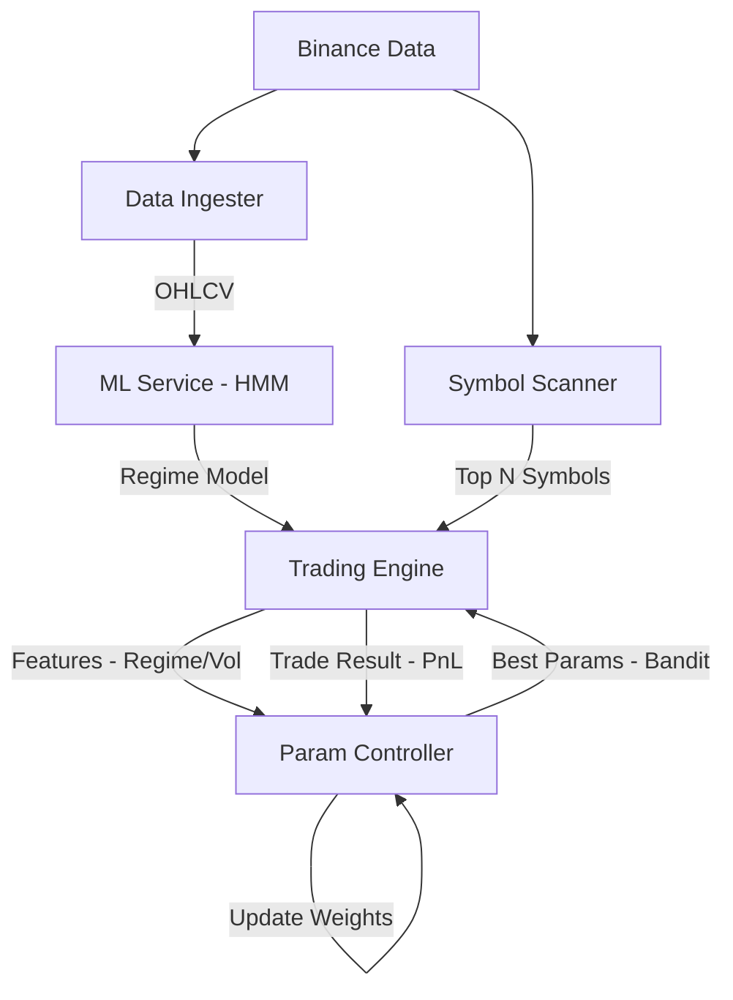

# Autonomous Trading Loop Architecture

This document describes the three-cycle autonomous trading workflow implemented in NAUTILUS.

## Overview

The system operates three parallel optimization cycles:

1. **Macro Cycle (Symbol Selection)** - *What to trade?*
2. **Meso Cycle (Regime & Tuning)** - *How to trade it?*
3. **Micro Cycle (Execution & Feedback)** - *Did it work?*



---

## Cycle 1: Macro - Dynamic Symbol Selection

**Goal:** Automatically rotate capital into the most active/profitable assets.

### Component
`engine/strategies/symbol_scanner.py` → `engine/universe/effective.py`

### Flow
1. **Scan:** Every `interval_sec` (e.g., 5 min), the scanner fetches recent klines for `SYMBOL_SCANNER_UNIVERSE`
2. **Score:** Symbols are ranked by composite score: `return × trend × volatility`
3. **Filter:** Volume and ATR filters ensure tradability
4. **Publish:** Updates `universe_state.json` with the `top_n` symbols
5. **Consume:** `StrategyUniverse.get()` prioritizes scanner selection

### Configuration
```bash
SYMBOL_SCANNER_ENABLED=true
SYMBOL_SCANNER_TOP_N=5
SYMBOL_SCANNER_INTERVAL_SEC=300
SYMBOL_SCANNER_UNIVERSE=BTCUSDT,ETHUSDT,SOLUSDT,AVAXUSDT,BNBUSDT
```

### Priority Chain
```
SymbolScanner.top_n() → {KIND}_SYMBOLS env → STRATEGY_SYMBOLS → TRADE_SYMBOLS
```

---

## Cycle 2: Meso - ML Regime Detection & Parameter Tuning

**Goal:** Adjust strategy behavior (risk, stops, aggression) based on market regime.

### Components
- `services/ml_service` - HMM training and inference
- `services/param_controller` - LinTS bandit for parameter selection
- `engine/strategies/policy_hmm.py` - Regime-aware strategy

### HMM Regime Detection

The HMM identifies three latent states:
| State | Description | Typical Behavior |
|-------|-------------|------------------|
| BULL (0) | Upward trending, low volatility | Aggressive longs |
| BEAR (1) | Downward trending, high volatility | Reduce exposure |
| CHOP (2) | Sideways, mean-reverting | Tight stops, scalp |

**Train a model:**
```bash
curl -X POST http://localhost:8015/train \
  -H "Content-Type: application/json" \
  -d '{"n_states": 3, "tag": "v1", "promote": true}'
```

**Get regime prediction:**
```bash
curl -X POST http://localhost:8015/predict \
  -H "Content-Type: application/json" \
  -d '{"logret": [0.001, -0.002, 0.003, -0.001, 0.002]}'
# Returns: {"probs": [0.6, 0.1, 0.3], "regime": "BULL", "confidence": 0.6}
```

### Dynamic Parameter Selection

The Param Controller uses **Linear Thompson Sampling** to select optimal parameters.

**Register a preset:**
```bash
curl -X POST http://localhost:8016/preset/register/trend_follow/BTCUSDT \
  -H "Content-Type: application/json" \
  -d '{
    "preset_id": "conservative_v1",
    "params": {"rsi_exit": 70, "atr_stop_mult": 1.5, "position_pct": 0.25}
  }'
```

**Get best parameters:**
```bash
curl "http://localhost:8016/param/trend_follow/BTCUSDT"
# Returns: {"config_id": "trend_follow:BTCUSDT:conservative_v1", "params": {...}}
```

---

## Cycle 3: Micro - Execution & Feedback Loop

**Goal:** Learn from every trade to improve future parameter selection.

### Flow
1. **Execute:** Strategy places order tagged with `config_id` from Param Controller
2. **Monitor:** `OrderRouter` tracks the fill
3. **Reward:** When trade closes, compute realized PnL
4. **Feedback:** Send reward to Param Controller
5. **Update:** Bandit model adjusts weights

### Report Outcome
```bash
curl -X POST http://localhost:8016/learn/outcome/trend_follow/BTCUSDT/conservative_v1 \
  -H "Content-Type: application/json" \
  -d '{"reward": 0.023, "features": {"regime": 0, "volatility": 0.02}}'
```

Over time, the bandit learns which presets perform best in which contexts.

---

## Services Summary

| Service | Port | Purpose |
|---------|------|---------|
| engine_binance | 8003 | Core trading engine |
| ml_service | 8015 | HMM regime training/inference |
| param_controller | 8016 | Bandit parameter selection |
| data_ingester | 8013 | OHLCV data collection |
| ops | 8002 | Frontend API gateway |

---

## Configuration Checklist

### Enable Autonomous Mode
```bash
# Symbol Scanner
SYMBOL_SCANNER_ENABLED=true
SYMBOL_SCANNER_TOP_N=5

# ML Integration
ML_SERVICE_URL=http://ml_service:8000

# Param Controller
PARAM_CONTROLLER_URL=http://param_controller:8002

# Strategy Auto-Tuning
TREND_AUTO_TUNE_ENABLED=true
```

### Prime with Presets
Before live trading, seed the Param Controller with backtested configurations:

```bash
# Conservative preset
curl -X POST http://localhost:8016/preset/register/trend_follow/BTCUSDT \
  -d '{"preset_id": "conservative", "params": {"rsi_exit": 70, "stop_mult": 1.5}}'

# Aggressive preset  
curl -X POST http://localhost:8016/preset/register/trend_follow/BTCUSDT \
  -d '{"preset_id": "aggressive", "params": {"rsi_exit": 80, "stop_mult": 2.0}}'
```

---

## Metrics & Observability

### Key Endpoints
```bash
# HMM model status
curl http://localhost:8015/model

# Trade statistics (win rate, sharpe, drawdown)
curl http://localhost:8003/trades/stats

# Parameter selection history
curl http://localhost:8016/param/trend_follow/BTCUSDT
```

### Prometheus Metrics
- `hmm_regime_state` - Current detected regime (0=BULL, 1=BEAR, 2=CHOP)
- `bandit_selection_total` - Preset selections by strategy/instrument
- `symbol_scanner_top_symbols` - Currently selected symbols

---

## Limitations

1. **Backtest Suite:** Not yet implemented (`services/backtest_suite/app/` is a stub)
2. **HMM Partial Fit:** `hmmlearn` does not support incremental updates
3. **Cold Start:** Bandit needs initial presets from offline analysis
4. **DRY_RUN Mode:** Mutating operations blocked until `DRY_RUN=0`
